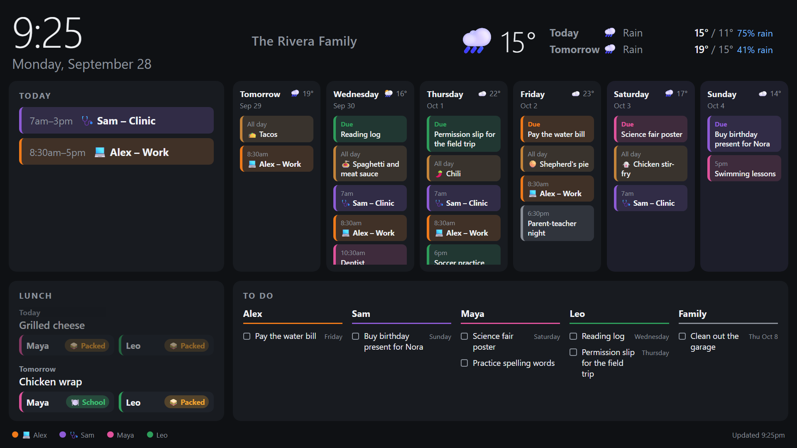
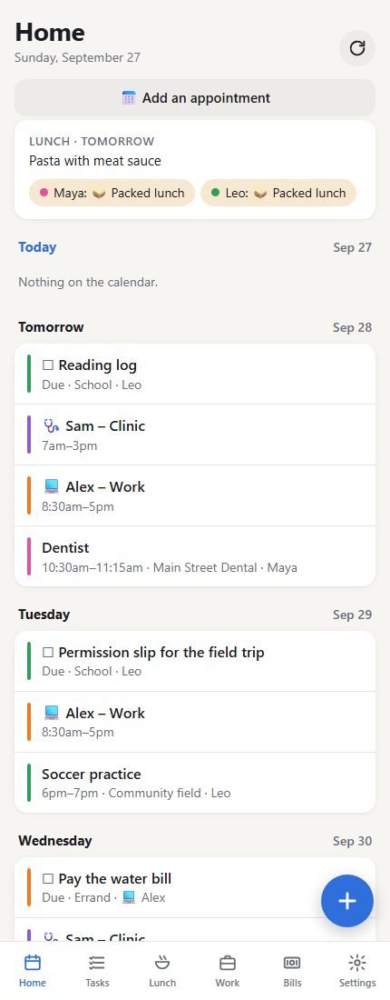
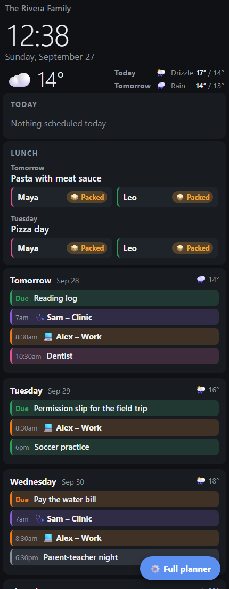
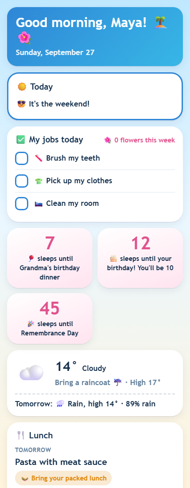
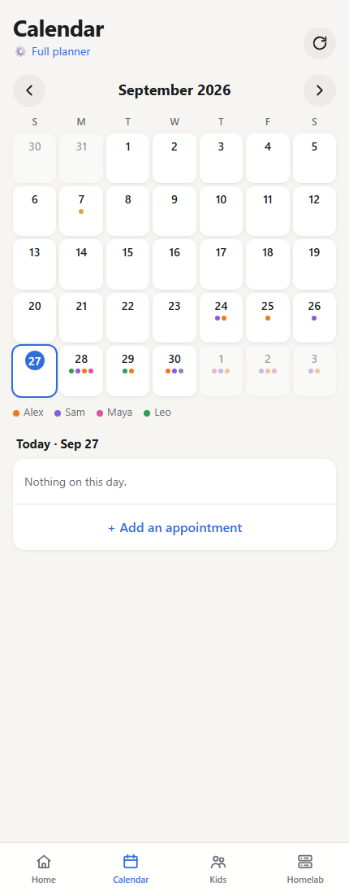

# Family Planner

**A self-hosted family organizer for your homelab.** One small container gives your family a shared
calendar, to-dos and school projects, school lunches, work shifts, bills, a wall screen for the kitchen,
and a fun page for each kid. It runs on your own server: a Proxmox LXC, a mini PC or a Raspberry Pi.

<p align="center">
  
</p>
<p align="center">
  
  
  
  
</p>

## Features

- **Wall display** for an old monitor and a Raspberry Pi: clock, weather, today, the next six days, lunches
  and everyone's to-dos. It dims at night.
- **Phone app** (add it to the home screen on iPhone or Android): tasks and school projects, appointments,
  a lunch planner, work shifts and bills.
- **Kids' pages** with chores and weekly stars, to-dos they can add themselves, countdowns to birthdays
  and days off, a joke and a fact of the day, and optional 7 am school-morning notifications.
- **Bedtime and homework routines**: a checklist for school nights and one for weekends, with a reminder
  on the kid's phone for each step that isn't ticked. **Rewards** the kids save their stars for.
- **Teacher emails**: upload an Outlook `.msg`, an `.eml`, a PDF or a photo (or paste the text) and the
  planner picks out no-school days, events, "Day N" numbers, gym and music days, to-dos and school
  payments (Rycor, School Cash Online and similar) for you to tick. Scans and photos are read with Tesseract OCR.
- **Meals**: a supper plan (on the wall screen too), a shared grocery list sorted by aisle, what's in the
  house, recipes, "cook with what we have" ideas (your recipes plus TheMealDB), and flyer deals near your
  postal or ZIP code (Flipp, US and Canada).
- **Medicine**: a medicine cabinet, pill reminders with a follow-up, spacing and daily limits for kids'
  medicine (with a warning if it's too soon), puffer counters, temperatures and symptoms, and a printable
  doctor report with a spreadsheet.
- **Notifications for the adults**: an 8 pm "tomorrow" check (school day, gym, lunches, appointments,
  forms, low puffers, unticked homework), medicine given to a kid, and homelab alerts.
- **What to wear**: the forecast becomes "🧥 Winter coat, hat and mittens", "☔ Raincoat" or "🧢 Sunscreen" on
  the kids' pages, their morning notification and the 8 pm check.
- **Kids' money**: a weekly allowance (optionally only if they got enough stars that week), stars cashed in,
  gifts and spending, with the balance on their page.
- **House page** (`/house`): car and house upkeep (oil changes, tire swaps, furnace filters, smoke alarms…)
  with reminders, the family's contacts with tap-to-call, and a printable sheet for the babysitter.
- **Admin page** (`/admin`): every setting in tabs, with an overview of what needs attention and whether
  everything is working. Choose which tabs each adult's page shows.
- **Work shifts**: tap days on a month grid, or type a week the way a paper schedule looks
  ("Mon 8-11 Office, 5:30-7:30pm Clinic").
- **Google Calendar**: shows your family's Google calendars, and can copy appointments made in the
  planner into Google.
- **Calendar feeds** for iPhone and Android: shifts, task due dates, and bill and reminder alerts.
- **Sign-in** with a family PIN, a PIN for each person, or Face ID / fingerprint (passkeys). A kid
  sign-in only sees the kids' pages; a "phone access" sign-in only sees the board and their own shifts.
- **Holidays** for about 250 countries and their provinces/states, with an optional Day 1–N school rotation.
- **My page** for adults: the family board, a month calendar, a card for each kid, and an optional
  **Homelab** tab (Proxmox, AdGuard Home, speed tests every hour, devices on the network).
- **Private by design:** everything lives in one SQLite file on your server. No accounts, no cloud,
  no tracking.

## Install

### Proxmox VE (one line)

Open your Proxmox node's **Shell** and run:

```bash
bash -c "$(curl -fsSL https://raw.githubusercontent.com/MonkeyMatt87/family-planner/main/proxmox/install.sh)"
```

It asks a few questions (the defaults are fine), creates a Debian LXC with Docker (2 cores, 1 GB RAM,
8 GB disk, DHCP), installs the planner and prints its address. Then open
**`http://<container-ip>:8080/setup`** from a device on your home network.

Options: `--ctid 120 --ip 192.168.1.50/24 --gw 192.168.1.1 --storage local-lvm --homelab -y`
(run with `--help` for all of them).

Tested on Proxmox VE 9.1: install, update (`pct exec <id> -- bash /root/install.sh`) and a reboot, with the
family's data kept. It takes a few minutes, most of it building the planner.

### Any Debian or Ubuntu machine

```bash
curl -fsSL https://raw.githubusercontent.com/MonkeyMatt87/family-planner/main/scripts/install.sh | sudo bash
```

This installs Docker if needed and puts the planner in `/opt/family-planner`. Add `-s -- --homelab` after
`bash` for the Homelab tools.

### From a downloaded release (no GitHub access needed)

Download `family-planner-vX.Y.Z.tar.gz` from [Releases](https://github.com/MonkeyMatt87/family-planner/releases),
copy it to the machine, then:

```bash
tar -xzf family-planner-v*.tar.gz scripts/install.sh proxmox/install.sh
sudo bash proxmox/install.sh --release family-planner-v*.tar.gz   # on a Proxmox host: makes the LXC
sudo bash scripts/install.sh --release family-planner-v*.tar.gz   # on any Debian/Ubuntu machine
```

The machine still needs internet access to install Docker and the Python packages the first time.

### Docker Compose (by hand)

```bash
git clone https://github.com/MonkeyMatt87/family-planner.git && cd family-planner
cp .env.example .env        # set TZ
docker compose up -d --build
```

## First run

Open `http://<server>:8080/setup` **from your home network**. For safety, a new planner won't let anyone
on the internet set it up. You add:

1. Your family: names, colours, and who's an adult or a kid.
2. Your town. It sets the weather, the holidays and °C or °F.
3. A **family PIN** (4–10 digits) for signing in.

That's it. Everything else is in **Settings**: people and their own PINs, Google calendars, shift types,
the school year, lunch menus, bills and calendar feeds.

**Want to look around first?** On a fresh install, run
`docker exec family-planner python -m app.demo` to fill in a made-up family (PIN `2468`). To start over,
stop the planner and delete `data/planner.db`.

## Reach it from your phones

At home, phones open `http://<server>:8080`. From anywhere else, pick one of these:

- **Cloudflare Tunnel** (a free Cloudflare account and your own domain). In Zero Trust, go to
  Networks → Tunnels → Create, then add a public hostname such as `family.example.com` pointing to
  **HTTP `planner:8080`**. Put the token in `/opt/family-planner/.env` as `CLOUDFLARE_TUNNEL_TOKEN=`,
  set `COMPOSE_PROFILES=tunnel`, and run `docker compose up -d`. Then enter the address in
  Settings → General → Public web address.
- **Tailscale** (no domain needed). Install Tailscale on the server, or as a subnet router on your
  Proxmox host, and on each phone.

Visits through the internet always need the PIN (or Face ID). Face ID and fingerprint sign-in need the
https address.

**Kids' morning notifications** need https at home too. The `https` profile runs Caddy with a real
Let's Encrypt certificate for a name like `home.example.com`. Point its DNS to the server's home IP
(DNS only), set `HOME_DOMAIN` and a Cloudflare "Edit zone DNS" token in `.env`, add `https` to
`COMPOSE_PROFILES`, then enter the address in Settings → General → Home https address.

## The wall display (Raspberry Pi)

On a Raspberry Pi with Raspberry Pi OS (desktop):

```bash
curl -fsSLO https://raw.githubusercontent.com/MonkeyMatt87/family-planner/main/pi/setup-kiosk.sh
bash setup-kiosk.sh http://<server>:8080/display 22:30 06:00    # screen off at 22:30, on at 6:00
```

It opens the display full screen at boot, hides the mouse and dims at night.

## Google Calendar

- **Show Google calendars:** in Google Calendar on a computer, go to Settings → your calendar →
  Integrate calendar and copy the **Secret address in iCal format**. In the planner, add it under
  Settings → Google Calendars. Events that start with a name ("Emma - Dentist") get that person's colour.
- **Copy the planner's appointments into Google:** create a Google Cloud service account with the
  Calendar API enabled and share your calendar with its address ("Make changes to events"). Then paste
  its JSON key and the calendar ID under Settings → Copy appointments to Google.

## Homelab tab (optional)

My page (`/me`) → **Homelab** shows:

- **Proxmox:** CPU, memory, disk, 24-hour charts, and every container and VM with its IP. Create an
  API token with the **PVEAuditor** role on `/`. With privilege separation on, give the role to both the
  user and the token.
- **AdGuard Home:** lookups, the % blocked, the busiest devices and an on/off switch.
- **Speed tests** every hour, and **devices on your network**, from the `homelab` profile. Enable it with
  `--homelab` in the installers, or add it to `COMPOSE_PROFILES`.

Enter the addresses and logins under My page → Homelab → *Homelab addresses and logins*. They stay on
the server and are never sent to a browser.

## Updating, backups, removing

- **Update:** run the installer again (on Proxmox: `pct exec <id> -- bash /root/install.sh`). Your
  data and `.env` are kept.
- **Back up:** everything is in `/opt/family-planner/data/planner.db` (plus `.env`). The planner makes
  a copy every night at 2:30 in `data/backups` (the last 14 are kept); Admin → Backups can download one.
  Proxmox backups of the LXC cover all of it.
- **Remove:** `cd /opt/family-planner && docker compose down`, then delete the folder, or delete the LXC.

## Development

```bash
pip install -r requirements.txt
DATA_DIR=./data PLANNER_SCHEDULER=0 uvicorn app.main:app --reload --port 8080
```

It's FastAPI with SQLite and plain HTML/JS/CSS pages, with no build step and no frontend framework.
The app is `app/`, the pages are `app/static/`, and `app/db.py` holds the schema (new columns are added
on start).

## License

[MIT](LICENSE)
